# User Task API

Simple Spring Boot REST API for managing users and their tasks.

## Tech stack

- Java 21
- Spring Boot 3
- Spring Web
- Spring Data JPA (Hibernate)
- H2 Database
- Bean Validation
- SpringDoc OpenAPI (Swagger)
- Lombok

## Project structure

Layered architecture is used:

- `controller` - REST endpoints
- `service` - business logic
- `repository` - data access
- `entity` - JPA entities
- `dto` - request/response models
- `exception` - global error handling

## Data model

- `User` (id, name, email)
- `Task` (id, title, description, status, user)
- Relationship: one user has many tasks (`OneToMany` / `ManyToOne`)

## How to run

1. Open the project in IntelliJ.
2. Run `UserTaskApiApplication`.
3. Application starts on `http://localhost:8081`.

## Useful URLs

- Swagger UI: `http://localhost:8081/swagger-ui.html`
- H2 Console: `http://localhost:8081/h2-console`

H2 login values:

- JDBC URL: `jdbc:h2:mem:usertaskdb`
- Username: `sa`
- Password: *(empty)*

## Main endpoints

### Users

- `POST /api/users`
- `GET /api/users`
- `GET /api/users/{id}`
- `PUT /api/users/{id}`
- `DELETE /api/users/{id}`

### Tasks

- `POST /api/tasks`
- `GET /api/tasks`
- `GET /api/tasks/{id}`
- `PUT /api/tasks/{id}`
- `DELETE /api/tasks/{id}`

## Notes

- Validation is applied on request DTOs.
- API returns proper error responses for invalid input and missing resources.
- Entities are not returned directly from controllers (DTOs are used).

## API test screenshots

### User endpoints

Invalid user create request (validation error):
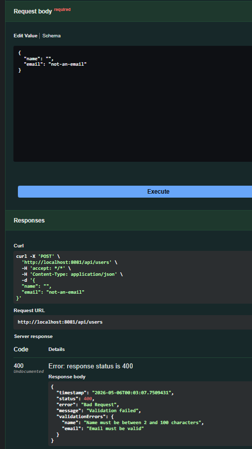

Valid user create request:
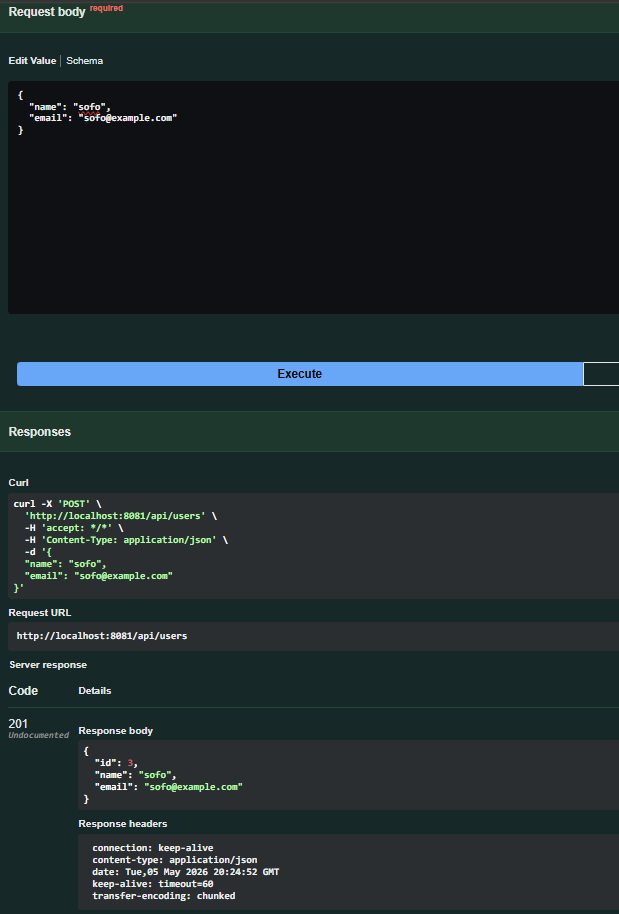

Get user by ID:
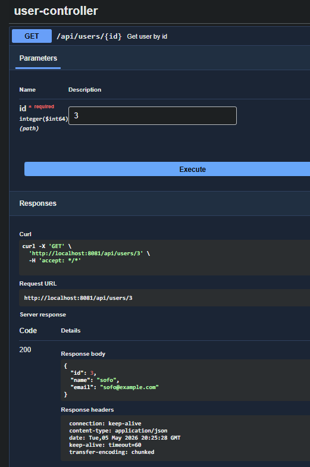

Get all users:
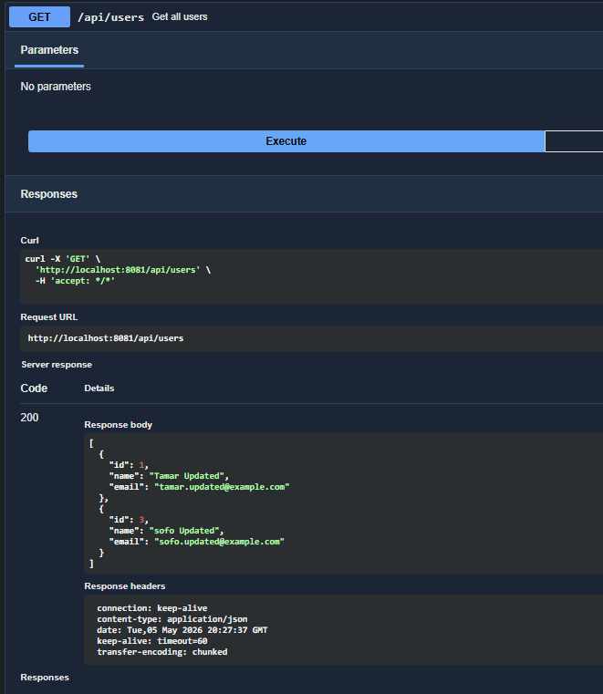

Update user:
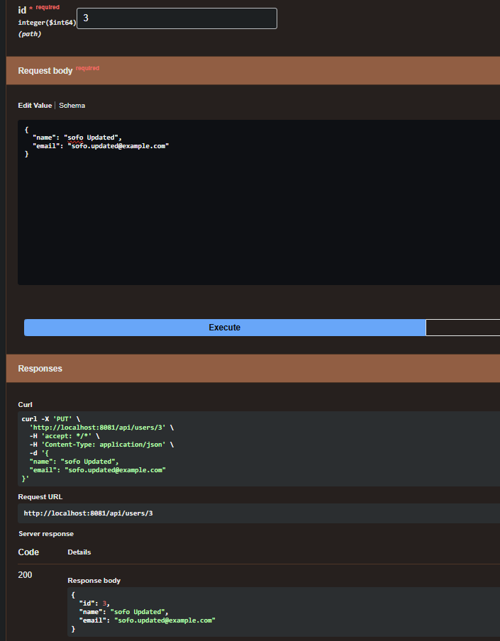

Delete user:
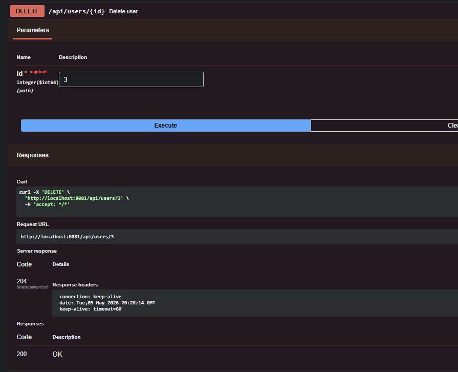

### Task endpoints

Create task:
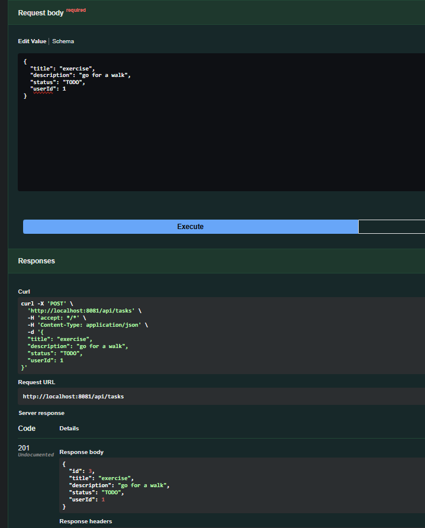

Get all tasks:
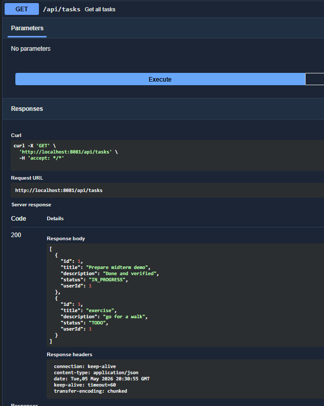

Update task:
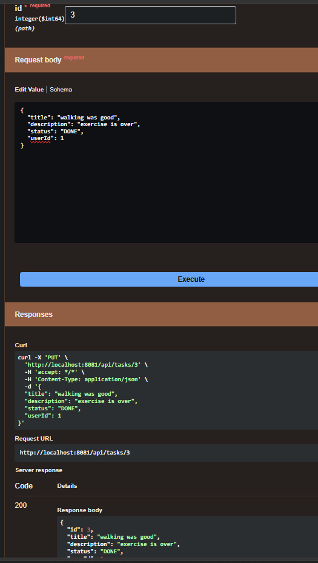

Get task by ID:
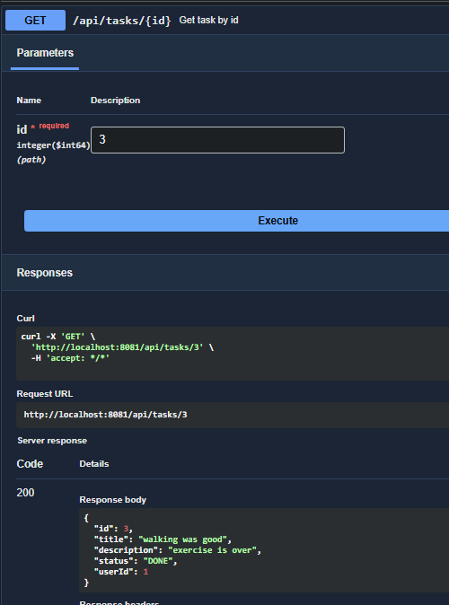

Delete task:
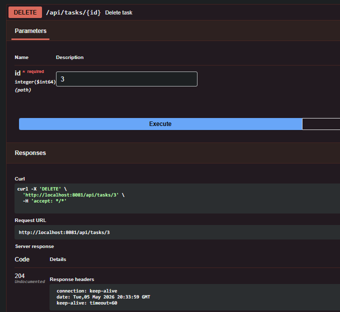

### Database (H2)

Users table in H2 console:
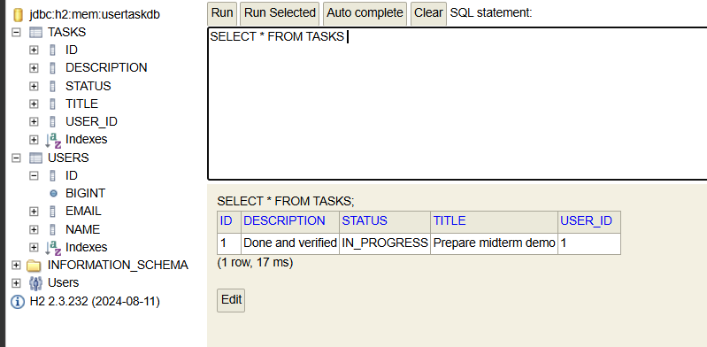

Tasks table in H2 console:
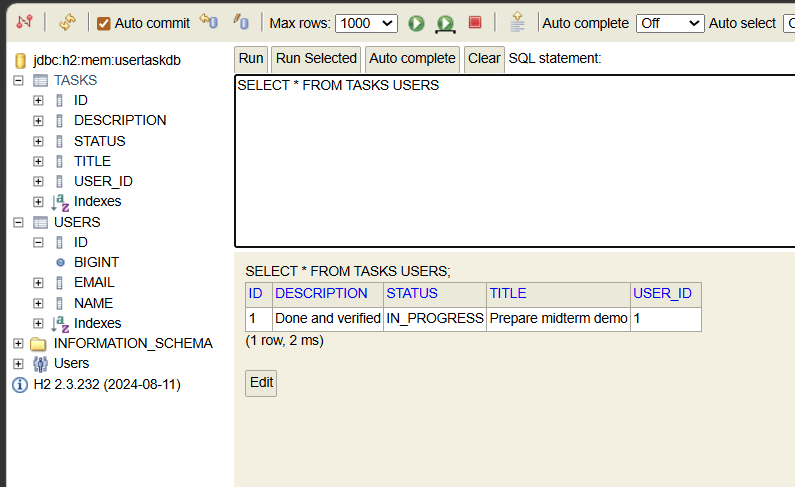